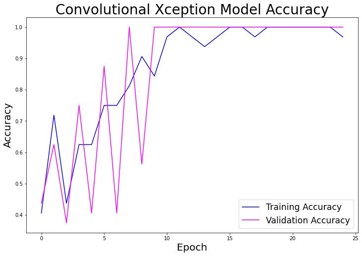

# Food Classifier CNN

## In this Repo:

- Part_01: Notebooks containing Part 1 of project as stated below
- Part_02: Notebooks of iterations for Part 2 of project
- Part_03: Notebooks of iterations for Part 3 of project
- images: saved images from notebooks of plots, image predictions, and images included in this readme file
- This README.md file

[Take a look at the slide deck for this project here](https://docs.google.com/presentation/d/1PdISy74dyAztVn5OvhQW2FoyhvugrGB2RcwJKMLgHkI/edit?usp=sharing)

# Problem Statement

AS AI GETS MORE ADVANCED, WE HAVE MORE USES FOR ROBOTICS THAN EVER BEFORE. THERE ARE MANY POTENTIAL USES FOR AI & ROBOTICS IN THE FOOD INDUSTRY, SO IN THIS PROJECT WE WILL BE USING MACHINE LEARNING WITH NEURAL NETWORKS TO PREDICT THE FOOD IN IMAGES.

## Datasets used:

[Download the Food-5k dataset here](https://drive.google.com/drive/folders/1sDgJysN8W8Q0WF2OruRpDZmoSUlwH7Od?usp=sharing)

[Download the Food-11 dataset here](https://drive.google.com/drive/folders/1sLtHQfj1EYu5xvevpso_miyH8KY4HW0C?usp=sharing)

## Libraries used:

- import pandas as pd
- import numpy as np
- from numpy.random import seed

- from sklearn.preprocessing import StandardScaler
- from sklearn.model_selection import train_test_split
- from sklearn.metrics import accuracy_score

- import tensorflow as tf
- from tensorflow import keras
- from tensorflow.keras import Model, layers
- from tensorflow.keras.models import Sequential
- from tensorflow.keras.layers import (Dense, Dropout, Flatten, Conv2D,
                                     SeparableConv2D, ReLU, MaxPooling2D, Add, Input, BatchNormalization, MaxPool2D, GlobalAveragePooling2D
- from tensorflow.keras.optimizers import Adam, SGD, RMSprop
- from tensorflow.keras.preprocessing import image
- from tensorflow.keras.callbacks import EarlyStopping
- from tensorflow.keras.applications.vgg16 import VGG16, decode_predictions, preprocess_input
- from tensorflow.keras.applications.xception import Xception, decode_predictions, preprocess_input

from PIL import Image

import matplotlib.pyplot as plt
import matplotlib.image as mpimg
import requests
import os

## Metrics:

We will be measuring accuracy and loss of the model predictions:

Goal 1: 90% accuracy

Goal 2: Less than 1.0 loss

## Can a machine correctly classify food images?

This project began with great ambition and quickly had to humble itself after spending two entire days running one very large dataset through a model which sadly achieved just 9% accuracy. It began as a food identifier for a dataset with 101 classes with 1000 images in each class for a total of 101,000 images. The images in the dataset are not high quality, and are mostly taken on phones, as they would if this was being used in an app. In order to figure out how to get a better score on our entire dataset, we decided to start much smaller and with a subset of classes and go from there.

## EDA

We started with performing a very brief EDA on our data for each iteration of the project. We used an image data generator which pulls the images in from the given directory by batches and resizes it to the size we need all the images to be. Next, we separated our images and labels into X and y and turned them into Numpy arrays for both training and testing, and rescaled our data pixels to be between 0-1 which keeps our range of weights in a small range. In order to check our images and make sure they looked ready to be put into the model, we displayed a grid of the images from our processed data.

## Modeling: Part 1

Since we are modeling image classification, we decided to use Google's Tensorflow Keras library with Convolutional Neural Networks with and without pre-trained model weights. Each convolutional layer has a number of filters that are moved over each image and features are extracted by importance using a formula of weights and biases. These models are considered to be unsupervised, as the model itself is doing its own work beneath the surface, which we don't have much say about. With unsupervised machine learning, in order to improve model performance we can change our inputs and our hyper-parameters, but the model will be doing the heavy lifting.

Using the Food-5k dataset which has 2 classes: food and not-food, we were able to achieve 100% fairly quickly. We started out with a simple FFNN model which didn't perform so well, getting around 60-70% accuracy, but this was just to have something to compare to our CNN model. We built our CNN with only two convolution layers and pooling layers and 5 dense layers, a batch size of 32 and 40 epochs. Our CNN reached 90.62% at its best. After doing some research on which models perform best on images, we found many pre-trained model weights which can be used for transfer learning. After trying out several of them, we found that (as research had stated) the Xception pre-trained model performs best on our data. By using the Xception CNN, which has 22M parameters and 36 convolutional layers, we quickly raised our best score to 100%.

## Modeling: Part 2

Moving on from our Food-5k, we turned back to our original dataset, Food-11, but this time we subsetted the classes by categories in order to start with just a small number of classes and go up from there.

In order to ensure we were using the best pre-trained model weights, we decided to compare 2 of the top rated pre-trained models by accuracy: Xception and VGG16. Using a subset of "bar food" with 3 classes: french fries, onion rings, and chicken wings (can you imagine how hungry this project made me??). After running our 3 models, Xception, VGG16, and a custom built CNN, we found that Xception was far superior to the other two we used. Moving forward, we only used Xception pre-trained weights. Our Xception model's best accuracy score was 100% training and 96.9% validation, which was 55% better than our VGG16 validation accuracy of 62.5% and much less overfit, and 138% better than our custom CNN with a validation score of 40.6%!

Next, we wanted to try more classes so we used a subset of 4 classes under the Seafood category we created, with the classes: oysters, mussels, sashimi, and scallops. We ran the same Xception model that we used for the Food-5k dataset and achieved 100% training accuracy but 78% validation accuracy which meant our model was pretty overfit. After doing some more research we found that using data augmentation might help boost our model performance. Data augmentation is a method of supplementing image data by using methods of creating new images to train on from the original images in the dataset. Using this method, we were able to raise our accuracy for validation to 100%.

Here is an example of data augmentation:

## Modeling: Part 3

Next, we wanted to use a larger subset to train our model on, so we used a subset we called Desserts, which contained 20 classes for 20,000 total images. We ran the same models on them, but even after making several changes to the parameters, our best scores were 28% for the Xception model without data augmentation and 63% for the model with data augmentation. It seems the more classes a dataset has, the more difficult it is to train the model and get a good model performance.

** Here are our loss and accuracy using the model without data augmentation:

** And here are our loss and accuracy  using our data augmentation model:

** Here are our predictions on 9 random images from our dataset using the model without data augmentation:

** And here are those same images with predictions using our data augmentation model:

## Conclusions

After running numerous different CNN models with different hyperparameters and different amounts of images and classes, we've learned the following:

Preprocessing:
- Image data should be preprocessed before modeling
- Images should be resized to each be the same size and shape
- Turning the images into Numpy arrays and normalizing the data points to be between 0-1 minimizes the data sizes going into the models which speeds up the model runtime without losing performance.
- Data augmentation greatly boosts the model performance, since it adds many more images for the model to train on.
Models
- Using a model with pre-trained weights such as Xception helps boost model performance without as much time trying many different layers with a custom model.
- Hyper-parameters should match the type of data and number of classes being predicted. We used the 'softmax' activator in our final layer which works best for predicting more than 2 classes, and we used SGD for our optimizer which we found gave us the best and most reliable model performance.
- Using an optimizer with a scheduled learning rate helps boost performance as the learning rate is minimized exponentially over the steps of the model.
- The more classes there are to predict, the more difficult it will be for the model to perform well since the data is basically diluted. The more classes there are, the more images you will need in each class to make up for the dilution.

## Conclusions
Our initial model with just 2 classes was fairly quickly able to get 100% accuracy on both training and testing using a fairly simple CNN. After changing our data to a dataset with 4 classes, we were able to get up to 100% accuracy using an Xception CNN model with data augmentation. At 20 classes, we dropped to about 28% accuracy using the same model without data augmentation and 63% with data augmentation. Data augmentation not only greatly improved the performance of the models, it also greatly reduced the overfitting problem we had with the models without augmentation.

## Future Recommendations

Running each model with data augmentation (and larger datasets in general) takes 1-4 hours, even when running on GPUs which is to say that this project in it's entirety will be time-consuming. In order to achieve a better model performance, more time needs to be taken to find more ways to improve upon our current models or try different models such as PyTorch. Some things that can be done to improve upon the model are adding more image data from other food image datasets to supplement our existing data, trying different preprocessing methods, stacking models, or possibly even building a model from scratch which would require more time to test run and rerun.

This project could serve as a basis for other projects such as:

- Classifying food portion sizes (using r-CNN masking)
- Predicting food calories or nutritional value based on food in image + food portions
- Food segmentation, such as food quality segmentation for industrial food separating and packaging
- AI for food service industry such as food service robots or food prep robots

Thank you for reading!
Any questions?
Contact me @ ywbadri@gmail.com
